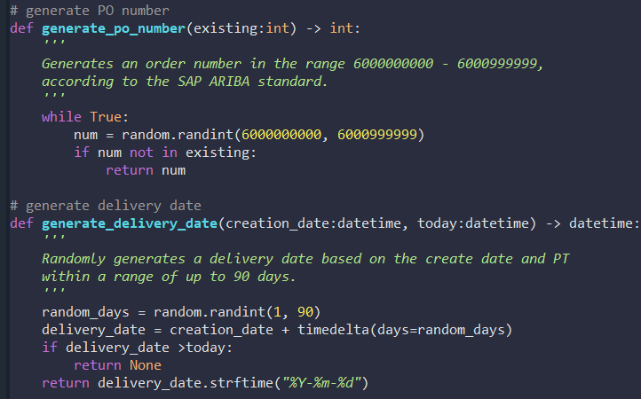
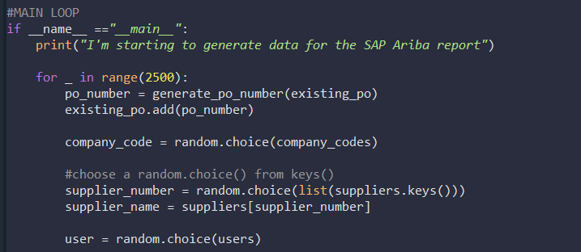
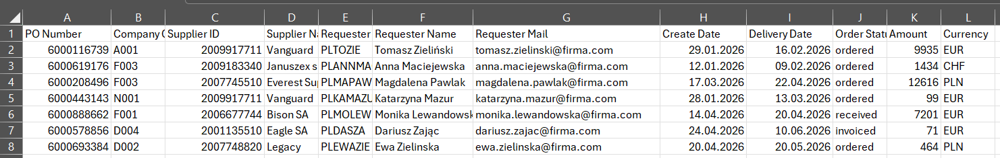

# SAP-Ariba-Mock-Data-Generator-for-Procurement-Analytics

A Python-based tool designed to generate synthetic, production-grade Purchase Order (PO) datasets, including the SAP Ariba Reporting standards.📊🧪 

🚀A Python-based tool designed to generate synthetic, production-grade Purchase Order (PO) datasets, including the SAP Ariba Reporting standards. It accurately mirrors the technical architecture, data engineering principles, and business logic of the SAP Ariba ecosystem.

💡 The Problem It SolvesProcurement professionals transitioning into data analytics face a major roadblock: the inability to work with real corporate data due to strict compliance rules, non-disclosure agreements (NDAs), and GDPR regulations.

🛠️ The Solution - This script allows domain experts and data analysts to instantly spin up a 100% compliant, secure, and realistic test environment. It provides the perfect dataset to practice data cleaning, exploratory data analysis (EDA), and data visualization.

IDE: Python

Modules: Pandas, Random, Datetime, CSV

📁 How to run?
1. Copy the repository.
2. Install the modules pip install -r requirements.txt
3. Run the script

How to adjust the amount of mock data? 🧪 
1. In the row 219 change the number in brackets --> for _ in range(2500)

💱 Why I decided for Python instead of AI? 

--> because the script is faster, we can genearte a mock dataset with 50 000 rows in some second and for the AI it would take ages, if not collapsed. 

--> because it is easy to change the data we need - the amount of rows, the amount of users, start date, delivery date etc.

--> because I do my projects from A to Z - AI helped me with names of companies and names of users, the rest is my own work. I prefer to work harder and understand the logic, cause one created it will be possible to easy repaeted in other environment. 

The script in the attachment. Below some pictures of code and generated excel file

### Contact:  

___________________________ POLISH VERSION ___________________________

Generator Danych Mockowych SAP Ariba dla Analityki Zakupowej (Procurement) 📊🧪 

🚀 Narzędzie w Pythonie zaprojektowane do generowania syntetycznych, produkcyjnej jakości zestawów danych zamówień zakupu (Purchase Orders). Odzwierciedla ono dokładną architekturę techniczną, inżynierię danych oraz logikę biznesową systemu SAP Ariba.

💡 Ten projekt rozwiązuje kluczowy problem ekspertów ds. zakupów (Procurement), którzy chcą przejść do obszaru analizy danych: brak możliwości pracy na realnych danych korporacyjnych ze względu na surowe zasady compliance, umowy NDA oraz regulacje RODO.

🛠️ Dzięki temu skryptowi, eksperci domenowi i analitycy danych mogą błyskawicznie stworzyć w 100% zgodne z przepisami, bezpieczne i realistyczne środowisko testowe do praktyki czyszczenia, eksploracji i wizualizacji danych.

IDE: Python

Moduły: Pandas, Random, Datetime, CSV

📁 Jak uruchomić? 
1. Sklonuj repozytorium.
2. Zainstaluj moduły pip install -r requirements.txt
3. Uruchom skrypt

Jak zmienić ilość danych testowych? 🧪 
1. W wierszu 219 zmień liczbę w nawiasach --> for _ in range(2500)

💱 Dlaczego zdecydowałem się na Python zamiast AI?

--> ponieważ skrypt działa szybciej, możemy wygenerować fikcyjny zbiór danych o 50 000 wierszach w kilka sekund, a AI zajęłoby to wieki, jeśli w ogóle by się nie zawiesiło.

--> ponieważ łatwo zmienić dane, które potrzebujemy - ilość wierszy, ilość użytkowników, datę rozpoczęcia, datę dostawy itp.

--> ponieważ robię moje projekty od A do Z - AI pomogło mi w nazwach firm i użytkowników, reszta to moja własna praca. Wolę pracować ciężej i rozumieć logikę, bo to, co stworzyłem, będzie można łatwo powtórzyć w innym środowisku.

### Kontakt:  

