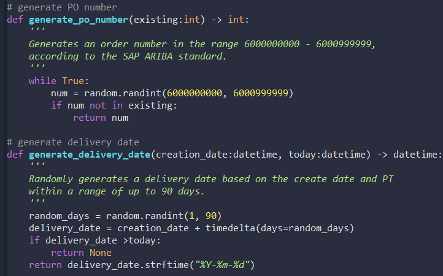
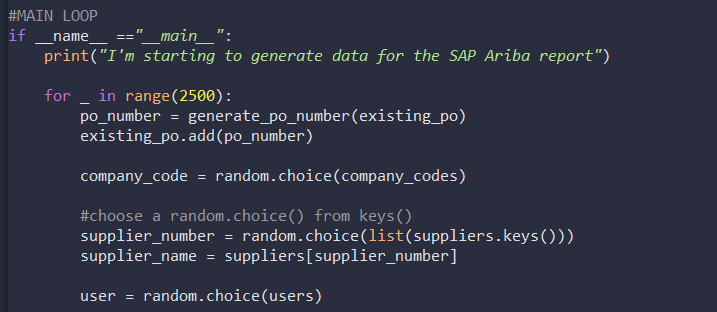
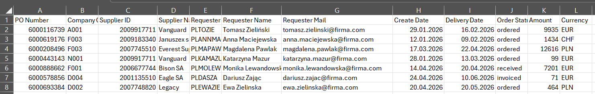

# SAP-Ariba-Mock-Data-Generator-for-Procurement-Analytics

A Python-based tool designed to generate synthetic, production-grade Purchase Order (PO) datasets, including the SAP Ariba Reporting standards.📊🧪 

🚀A Python-based tool designed to generate synthetic, production-grade Purchase Order (PO) datasets, including the SAP Ariba Reporting standards. It accurately mirrors the technical architecture, data engineering principles, and business logic of the SAP Ariba ecosystem.

💡 The Problem It SolvesProcurement professionals transitioning into data analytics face a major roadblock: the inability to work with real corporate data due to strict compliance rules, non-disclosure agreements (NDAs), and GDPR regulations.

🛠️ The Solution - This script allows domain experts and data analysts to instantly spin up a 100% compliant, secure, and realistic test environment. It provides the perfect dataset to practice data cleaning, exploratory data analysis (EDA), and data visualization.

IDE: Python

🧩 Modules: Pandas, Random, Datetime, CSV

Project's Structure:

The project is organized in a modular way to separate input data, source code, documentation, and generated outputs.  
Each folder serves a clear purpose:

| Folder / File | Description |
|----------------|-------------|
| **data/** | Contains input files used by the generator, e.g. regex patterns (`mock_regex.xlsx`, `regex1.xlsx`) for creating realistic SAP Ariba mock data. |
| **data_output/** | Stores generated datasets — e.g. `procurement_mock_2500.xlsx` is a sample output file. |
| **docs/** | Technical documentation and data description in Jupyter Notebook format (`data_description.ipynb`). |
| **images/** | Screenshots and visual examples (`mock1.png`, `mock2.png`, `mock3.png`, `po_status.png`) used in README to illustrate generator results. |
| **src/** | Source code of the project: <br>• `__init__.py` – module initializer <br>• `procurement_dataset1.py` – main SAP Ariba data generator script <br>• `procurement_mock_functions.py` – helper functions with professional docstrings forming the generator’s API. |
| **tests/** | Folder for unit tests and data validation scripts. |
| **README.md** | Project documentation describing purpose, workflow, and sample outputs. |
| **Dockerfile** | Runtime environment definition for containerization. |
| **requirements.txt** | List of required Python libraries. |
| **pytest.ini** | Configuration for automated testing. |
| **LICENSE** | Project license information (MIT). |
| **.gitignore** | Excludes unnecessary files from Git tracking. |

SAP-Ariba-Mock-Data-Generator-for-Procurement-Analytics/

├── data/

│   ├── mock_regex.xlsx

│   ├── regex1.xlsx

│   └── README.md

│

├── data_output/

│   └── procurement_mock_2500.xlsx

│

├── docs/

│   └── data_description.ipynb

│

├── images/

│   ├── mock1.png

│   ├── mock2.png

│   ├── mock3.png

│   └── po_status.png

│

├── src/

│   ├── __init__.py

│   ├── procurement_dataset1.py

│   └── procurement_mock_functions.py

│

├── tests/

│   └── (test files)

│

├── Dockerfile

├── LICENSE

├── pytest.ini

├── README.md

├── requirements.txt

└── .gitignore


📁 How to run?
1. Copy the repository.
2. Install the modules pip install -r requirements.txt
3. Run the script

   
🧪 How to run tests?

Project test run on module **pytest**.

To run tests:
```bash
python -m pytest -v
```

✨ Key Features

- Realistic procurement dataset generation — creates synthetic Purchase Orders, suppliers, users, companies and delivery windows that mimic SAP Ariba patterns.

- Business‑driven logic — all values follow procurement rules: lead times, approval flows, delivery dates, spend categories, and supplier behavior.

- Regex‑based validation — every generated field is validated using strict regex rules to ensure consistency and realism.

- GDPR‑safe synthetic data — no personal or confidential information; all records are fully anonymized and safe for analytics training.

- High performance generation — produces 50k+ rows in seconds, suitable for analytics, dashboards, and machine learning prototyping.

- Configurable output structure — users can adjust the number of records, date ranges, supplier pools, spend categories, and business rules.

- SAP Ariba‑aligned fields — column names and logic follow typical Ariba procurement objects (PO, Supplier, User, Company, Amount, Dates).

- Ready‑to‑use CSV output — generated files are saved in the /output folder and can be immediately imported into Power BI, Python, SQL or Excel.

- Deterministic and reproducible — seed‑based generation ensures identical results for testing and documentation.

- Extensible architecture — easy to add new fields, business rules, validation layers, or additional procurement modules (invoices, contracts, sourcing events).


How to adjust the amount of mock data? 🧪 
1. In the row 219 change the number in brackets --> for _ in range(2500)

💱 Why I decided for Python instead of AI? 

--> because the script is faster, we can genearte a mock dataset with 50 000 rows in some second and for the AI it would take ages, if not collapsed. 

--> because it is easy to change the data we need - the amount of rows, the amount of users, start date, delivery date etc.

--> because I do my projects from A to Z - AI helped me with names of companies and names of users, the rest is my own work. I prefer to work harder and understand the logic, cause one created it will be possible to easy repaeted in other environment. 


Future Improvements: ✨

- Expand the dataset with additional fields sourced from CORA to simulate multi‑system reporting (SAP Ariba + CORA) 

- Implement cross‑system merge logic to reflect real procurement workflows and enable deeper invoice‑related analysis 

- Extend the Jupyter Notebook with detailed description of SAP-Ariba-Mock-Data-Generator-for-Procurement-Analytics including the regex, business logic and rules

- Introduce modular data generators to support future integration with other ERP or financial systems 🧩

Full documentation and regex: 
[Documentation and regex](docs/data_description.ipynb)

Example of functions:
def generate_po_number(existing:int) -> int:
    '''
    Generates an order number in the range 6000000000 - 6000999999, 
    according to the SAP ARIBA standard.

    This function genertes a random PO number from the mentioned range.

    Args:
        existing (list[int]): 
            A list of already generated PO numbers to avoid duplicates.

    Returns:
        int: A unique PO number within the specified range.

    Example:
        >>> existing = [6000000001, 6000000002]
        >>> generate_po_number(existing)
        6000000347
    '''
  
    while True:
        num = random.randint(6000000000, 6000999999)
        if num not in existing:
            return num


The script in the attachment. Below some pictures of code and generated excel file




### Contact:  

[](mailto:kamila.dudzinska@onet.pl)
[](mailto:kamila.dudzinska@onet.pl)
[](https://www.linkedin.com/flagship-web/in/kamila-dudzi%C5%84ska-856bb31b8/)


___________________________ POLISH VERSION ___________________________

Generator Danych Mockowych SAP Ariba dla Analityki Zakupowej (Procurement) 📊🧪 

🚀 Narzędzie w Pythonie zaprojektowane do generowania syntetycznych, produkcyjnej jakości zestawów danych zamówień zakupu (Purchase Orders). Odzwierciedla ono dokładną architekturę techniczną, inżynierię danych oraz logikę biznesową systemu SAP Ariba.

💡 Ten projekt rozwiązuje kluczowy problem ekspertów ds. zakupów (Procurement), którzy chcą przejść do obszaru analizy danych: brak możliwości pracy na realnych danych korporacyjnych ze względu na surowe zasady compliance, umowy NDA oraz regulacje RODO.

🛠️ Dzięki temu skryptowi, eksperci domenowi i analitycy danych mogą błyskawicznie stworzyć w 100% zgodne z przepisami, bezpieczne i realistyczne środowisko testowe do praktyki czyszczenia, eksploracji i wizualizacji danych.

IDE: Python

🧩 Moduły: Pandas, Random, Datetime, CSV

Struktura projektu:
Projekt został zorganizowany w sposób modularny, aby oddzielić dane, kod źródłowy, dokumentację i wyniki generowania.  
Każdy folder pełni jasno określoną funkcję:

| Folder / Plik | Opis |
|----------------|------|
| **data/** | Zawiera pliki wejściowe używane przez generator, np. wzorce regexów (`mock_regex.xlsx`, `regex1.xlsx`) wykorzystywane do tworzenia realistycznych danych SAP Ariba. |
| **data_output/** | Folder z wynikami działania generatora — przykładowy plik `procurement_mock_2500.xlsx` zawiera wygenerowany zestaw danych. |
| **docs/** | Dokumentacja techniczna i opis danych w formacie Jupyter Notebook (`data_description.ipynb`). |
| **images/** | Zrzuty ekranu i wizualizacje projektu (`mock1.png`, `mock2.png`, `mock3.png`, `po_status.png`) używane w README do prezentacji efektów działania generatora. |
| **src/** | Kod źródłowy projektu: <br>• `__init__.py` – inicjalizacja modułu <br>• `procurement_dataset1.py` – główny skrypt generujący dane SAP Ariba <br>• `procurement_mock_functions.py` – zestaw funkcji pomocniczych z profesjonalnymi docstringami, stanowiących API generatora. |
| **tests/** | Folder przeznaczony na testy jednostkowe i walidację poprawności danych. |
| **README.md** | Dokumentacja projektu z opisem celu, działania i przykładowych wyników. |
| **Dockerfile** | Definicja środowiska uruchomieniowego dla konteneryzacji projektu. |
| **requirements.txt** | Lista wymaganych bibliotek Python. |
| **pytest.ini** | Konfiguracja testów automatycznych. |
| **LICENSE** | Informacja o licencji projektu (MIT). |
| **.gitignore** | Plik wykluczający niepotrzebne elementy z repozytorium Git. |

SAP-Ariba-Mock-Data-Generator-for-Procurement-Analytics/
├── data/
│   ├── mock_regex.xlsx
│   ├── regex1.xlsx
│   └── README.md
│
├── data_output/
│   └── procurement_mock_2500.xlsx
│
├── docs/
│   └── data_description.ipynb
│
├── images/
│   ├── mock1.png
│   ├── mock2.png
│   ├── mock3.png
│   └── po_status.png
│
├── src/
│   ├── __init__.py
│   ├── procurement_dataset1.py
│   └── procurement_mock_functions.py
│
├── tests/
│   └── (test files)
│
├── Dockerfile
├── LICENSE
├── pytest.ini
├── README.md
├── requirements.txt
└── .gitignore


📁 Jak uruchomić? 
1. Sklonuj repozytorium.
2. Zainstaluj moduły pip install -r requirements.txt
3. Uruchom skrypt

🧪 Jak uruchomić testy

Projekt korzysta z frameworka **pytest**.

Aby uruchomić testy:
```bash
python -m pytest -v
```

✨ Kluczowe funkcjonalności:

- Realistyczne generowanie danych zakupowych — tworzy syntetyczne zamówienia, dostawców, użytkowników, firmy i okna dostaw zgodne z logiką SAP Ariba.

- Logika biznesowa oparta na procesach zakupowych — wszystkie wartości podlegają regułom: lead time, ścieżki akceptacji, daty dostaw, kategorie wydatków, zachowania dostawców.

- Walidacja oparta na regexach — każdy wygenerowany atrybut jest sprawdzany za pomocą precyzyjnych wyrażeń regularnych.

- Dane zgodne z GDPR — brak danych osobowych; wszystkie rekordy są w pełni anonimowe i bezpieczne do celów analitycznych.

- Wysoka wydajność — generuje ponad 50 tys. wierszy w kilka sekund, idealne do dashboardów, testów i prototypów ML.

- Konfigurowalna struktura danych — użytkownik może ustawić liczbę rekordów, zakres dat, pulę dostawców, kategorie wydatków i reguły biznesowe.

- Pola zgodne z SAP Ariba — nazwy kolumn i logika odwzorowują typowe obiekty Ariba (PO, Supplier, User, Company, Amount, Dates).

- Gotowy plik CSV — pliki są zapisywane w folderze /output i można je od razu użyć w Power BI, Pythonie, SQL lub Excelu.

- Deterministyczne wyniki — generowanie oparte na seedzie pozwala na powtarzalne testy i dokumentację.

- Łatwa rozbudowa — prosta architektura umożliwia dodawanie nowych pól, reguł, walidacji lub modułów (faktury, kontrakty, sourcing).


Jak zmienić ilość danych testowych? 🧪 
1. W wierszu 219 zmień liczbę w nawiasach --> for _ in range(2500)

💱 Dlaczego zdecydowałem się na Python zamiast AI?

--> ponieważ skrypt działa szybciej, możemy wygenerować fikcyjny zbiór danych o 50 000 wierszach w kilka sekund, a AI zajęłoby to wieki, jeśli w ogóle by się nie zawiesiło.

--> ponieważ łatwo zmienić dane, które potrzebujemy - ilość wierszy, ilość użytkowników, datę rozpoczęcia, datę dostawy itp.

--> ponieważ robię moje projekty od A do Z - AI pomogło mi w nazwach firm i użytkowników, reszta to moja własna praca. Wolę pracować ciężej i rozumieć logikę, bo to, co stworzyłem, będzie można łatwo powtórzyć w innym środowisku.


Przyszłe ulepszenia: ✨

- Rozszerzenie zestawu danych o dodatkowe pola pochodzące z systemu CORA, aby zasymulować raportowanie wieloźródłowe (SAP Ariba + CORA) 

- Wprowadzenie logiki łączenia danych między systemami, odzwierciedlającej rzeczywiste procesy zakupowe oraz umożliwiającej głębszą analizę danych związanych z fakturami 

- Rozbudowa Jupyter Notebook o szczegółowy opis działania SAP‑Ariba‑Mock‑Data‑Generator‑for‑Procurement‑Analytics, obejmujący regexy, logikę biznesową oraz zasady generowania danych 

- Wprowadzenie modułowych generatorów danych wspierających przyszłą integrację z innymi systemami ERP lub finansowymi 🧩


Pełna dokumentacja i regex: 
[Documentation and regex](docs/data_description.ipynb)

Przykłady funkcji:
def generate_po_number(existing:int) -> int:
    '''
    Generates an order number in the range 6000000000 - 6000999999, 
    according to the SAP ARIBA standard.

    This function genertes a random PO number from the mentioned range.

    Args:
        existing (list[int]): 
            A list of already generated PO numbers to avoid duplicates.

    Returns:
        int: A unique PO number within the specified range.

    Example:
        >>> existing = [6000000001, 6000000002]
        >>> generate_po_number(existing)
        6000000347
    '''
  
    while True:
        num = random.randint(6000000000, 6000999999)
        if num not in existing:
            return num


Fragenty kodu:


<hr style="border:3px solid #AEC6CF;">

### Kontakt:  

[](mailto:kamila.dudzinska@onet.pl)
[](mailto:kamila.dudzinska@onet.pl)
[](https://www.linkedin.com/flagship-web/in/kamila-dudzi%C5%84ska-856bb31b8/)
